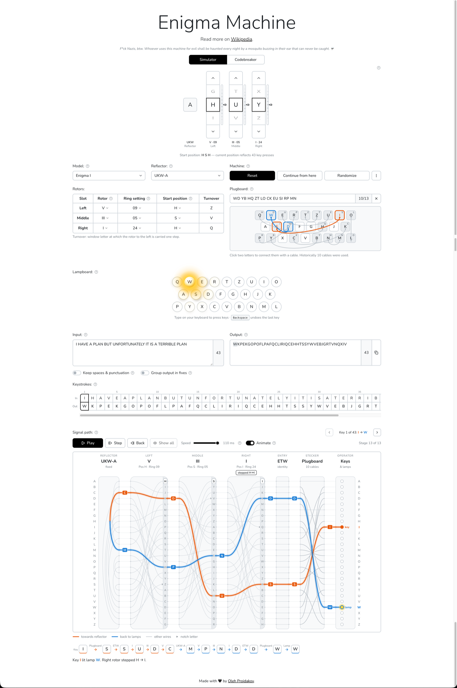
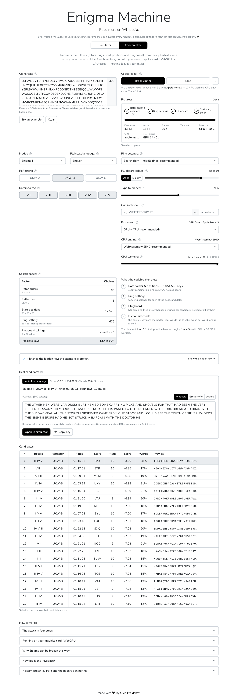

# Enigma Tools

Two tools for the German Enigma cipher machine, running entirely in the browser:

- **Simulator**: an Enigma I, M3 or M4 that shows how each key press travels through the plugboard, rotors and reflector to the lampboard.
- **Codebreaker**: recovers the full key (rotors, rings, start positions and plugboard) from ciphertext alone, using the method later cryptanalysts applied to wartime messages. The search runs on your CPU cores and, where available, your graphics card.

Nothing is uploaded: the cipher engine, the language statistics and your text stay in the browser tab.

```sh
yarn install
yarn dev        # http://localhost:5173
```

## Screenshots

### Simulator

Typing `I HAVE A PLAN…` on an Enigma I with 10 plug cables. The signal path shows the first key press: `I` travels through the plugboard, three rotors and reflector UKW-A and lights lamp `W`.



### Codebreaker

An English example (300 letters from *Treasure Island*) broken in 30 seconds on a Mac with an Apple GPU and 10 CPU workers (times depend on the hardware). The best candidate matches the hidden key and is shown in the Readable view.



---

## Where to find things

The app has two tabs at the top of the page. Each tab is a URL, so it can be bookmarked or shared:

| Tab | URL | What it is for |
| --- | --- | --- |
| **Simulator** | `#/simulator` (the default) | Set up a machine, type, watch the signal path |
| **Codebreaker** | `#/breaker` | Paste a ciphertext and recover its key |

A machine setup can travel in the URL: `#/simulator?key=I.UKW-B.I-II-III.AAA.AAA.` opens the simulator with that key (see [Key format](#key-format)). Both tabs remember their settings and text in `localStorage` between visits.

### Simulator

From top to bottom:

| Section | What it does |
| --- | --- |
| **Rotor windows** | The letters showing on each rotor. Scroll or drag a window to turn the rotor; a window flashes when its rotor steps. |
| **Machine** (settings table) | Model (I, M3, M4), reflector, which rotor sits in each slot, ring settings and start positions. On the M4 the Greek wheel is the extra leftmost slot. |
| **Machine** (buttons) | **Reset** clears the text and returns the rotors to the start position. **Continue from here** makes the current rotor letters the new start. **Randomize** picks a random key with 10 plug cables. The **⋮** menu copies a share link or key, imports a key, and switches ring display between numbers and letters. |
| **Plugboard** | Type pairs (`AB CD EF`) or click two sockets to connect them. |
| **Lampboard / Keyboard** | Click a key, or type on your computer keyboard; Backspace undoes the last key press. The lamp of the output letter lights up. |
| **Text** | Type or paste longer text. Options keep spaces and punctuation and group the output in fives, as operators wrote it. The keystroke tape lines up each input letter with its output. |
| **Signal path** | A wiring diagram of every component with the path of the selected key press, playback controls to step through it, and a stage-by-stage trace (plugboard → rotors → reflector → rotors → plugboard). Click a letter in the output text to show its path. |

Enigma is its own inverse: typing the ciphertext with the same key gives back the plaintext.

### Codebreaker

1. **Ciphertext.** Paste an intercepted message (at least 30 letters; a few hundred work best), or press **Try an example**. The example enciphers a public-domain passage with a random key, so you can check the result against the hidden key afterwards.
2. **Settings.** Defaults match the historical Army Enigma I: rotors I–V, reflector B and 10 plug cables.

   | Setting | Meaning |
   | --- | --- |
   | Model, Reflectors, Rotors to try, Greek wheels | The part of the keyspace to search. Fewer choices are faster. |
   | Plaintext language | German or English. This picks the letter statistics and the dictionary. |
   | Ring settings | Search the right and middle rings (recommended), only the right one, or assume `AAA`. |
   | Plugboard cables | The most cables to look for (0–13), or exactly that many. |
   | Typo tolerance | How many wrong letters a dictionary word may contain in the final check. |
   | Crib (optional) | A word known to be in the message, with its position if known. |
   | Processor | GPU + CPU (WebGPU) or CPU only. |
   | CPU engine | WebAssembly SIMD (faster) or the JavaScript reference. |
   | CPU workers | How many cores to use. |

   The search-space panel shows how many keys this means and an estimated time.
3. **Break cipher.** The progress panel shows the current phase, the speed and the best decrypt so far. **Stop** keeps the best results found so far.
4. **Results.**
   - **Best candidate** shows the key, its scores and the plaintext. The plaintext can be shown as **Readable** (split into words), **Groups of 5** or plain **Letters**.
   - **Open in simulator** loads the key and the ciphertext into the Simulator tab, and **Copy key** copies the key.
   - The **Candidates** table lists the 20 best keys; select a row to show it in the card.
   - For an example run, a banner says whether the hidden key was found.

The **How it works** panel at the bottom of the tab explains the attack inside the app.

---

## How the Enigma works

Pressing a key closes a circuit. The current runs through these stages and lights a lamp:

```text
key → plugboard → entry wheel → right → middle → left rotor → [Greek wheel] → reflector
lamp ← plugboard ← entry wheel ← right ← middle ← left rotor ← [Greek wheel] ←──┘
```

- **Plugboard** (Steckerbrett): cables swap pairs of letters, once on the way in and once on the way out.
- **Rotors**: each one is a fixed scrambling of the alphabet, offset by its current position and its ring setting.
- **Reflector** (Umkehrwalze, UKW): sends the current back through the rotors along a different path. This is why encryption and decryption are the same operation, and why no letter can ever encrypt to itself.
- **Stepping**: before every key press the right rotor steps. The middle rotor steps when the right rotor passes its notch, and the left rotor when the middle one does. The middle rotor also steps on its own notch ("double stepping"). The M4's Greek wheel never moves.

Supported machines (wirings and notches from the [Enigma rotor details](https://en.wikipedia.org/wiki/Enigma_rotor_details) tables, checked against Crypto Museum):

| Model | Rotors | Reflectors | Notes |
| --- | --- | --- | --- |
| Enigma I (Army / Air Force) | 3 of I–V | UKW-A, B, C | |
| Enigma M3 (Navy) | 3 of I–VIII | UKW-B, C | VI–VIII have two notches (Z and M) |
| Enigma M4 (U-boats) | Greek wheel β or γ + 3 of I–VIII | thin B, thin C | The Greek wheel adds a fourth, non-stepping position |

The engine is in [`src/lib/enigma`](src/lib/enigma). [`machine.ts`](src/lib/enigma/machine.ts) steps the rotors, enciphers letters and records a full trace of each key press for the visualisation. Its output is tested against published reference messages.

### Key format

A key is a compact, URL-safe string, `model.reflector.rotors.rings.positions.plugs`, with rotors, rings and positions listed left to right:

```text
I.UKW-B.II-IV-I.ANV.ADB.AB-CD-EF            Enigma I, rotors II IV I, rings A N V, start A D B, 3 plug pairs
M4.UKW-B-thin.Beta-II-IV-I.AAAV.VJNA.AT-BL  M4: Greek wheel first, four rings and positions
```

The plug list may be empty (`I.UKW-B.I-II-III.AAA.AAA.`). The **Copy key** buttons, the share links and **Import key…** all use this format.

---

## How the codebreaker works

Trying every key is hopeless. An Enigma I with five rotors and ten cables has about 1.6 × 10²⁰ keys before counting ring settings. The attack instead recovers the key **one part at a time**, keeping only the most promising settings after each phase. This is the ciphertext-only method of Gillogly (1995) and Weierud & Sullivan (2005).

It works because of three weaknesses:

- **The plugboard leaves letters alone.** With ten cables, six letters stay unplugged, so a decrypt with the right rotors and no plugboard still shows some of the language's letter statistics. The rotors can therefore be found before the plugboard.
- **The rotors step like an odometer.** The right rotor moves on every key press, the middle one every 26 letters, and the left one hardly ever. A nearly right key gives a nearly right decrypt, so the search can improve a key step by step.
- **Ring settings mostly shift the start position.** They only change *when* a rotor carries its neighbour, so they can be searched late.

### Scores

| Score | What it measures | Used for |
| --- | --- | --- |
| **Index of coincidence (IoC)** | The chance that two random letters of the text are equal: about 0.066 for English, 0.076 for German, 0.038 for random letters. | Spotting language statistics cheaply. |
| **Bigram / trigram / quadgram log-likelihood** | How probable each run of 2, 3 or 4 letters is in the chosen language. The tables are built from public-domain books. | Telling real text from noise once the decrypt is close. |
| **Dictionary coverage** | The share of letters that form dictionary words, allowing a few typos. Correct keys reach 85–100%; wrong ones stay below about 30%. | The final ranking. |

### The four phases

1. **Rotor order and start positions** (`rotors`): almost all of the work.
   - Every reflector, every ordered choice of three rotors (60 for the Enigma I) and all 26³ = 17,576 start positions are tried. On the M4 this is multiplied by the Greek wheel and its 26 positions.
   - Each setting gets a quick plugboard hill climb under a few likely ring and turnover timings, scored by IoC.
   - The best tenth then tries every right-ring timing and possible left-rotor turnover, ranked by bigram score.
   - The best 1,000 settings survive.
2. **Rings** (`rings`): for each survivor, the right (and middle) ring is tried in all 26 positions. The start position moves to compensate, and the result is scored by IoC again.
3. **Plugboard** (`plugboard`): hill climbing.
   - Try every swap of two letters, keep the one that improves the score most, and repeat until nothing helps, with random restarts.
   - The score starts as the IoC and switches to trigram and quadgram statistics.
   - Once the plugboard is solved, every ring timing is tried again on the full text. This repairs keys whose turnover falls one step early or late.
4. **Dictionary check** (`words`): the best 20 keys are decrypted and split into dictionary words, and the share of letters in words re-ranks them. A near miss gets one more plugboard pass aimed at repairing broken words.

**Crib.** Enigma never encrypts a letter to itself, so a known word can only sit at offsets where none of its letters match the ciphertext letter beneath it. A crib limits the search to those offsets and adds a bonus to keys that decrypt it.

### Running fast

- **Web Workers.** The rotor orders are split into units that the CPU workers take from a shared queue, so the page stays responsive.
- **WebAssembly SIMD.** By default the CPU workers run phase 1 as WebAssembly with 128-bit SIMD instructions. The kernels are written in AssemblyScript in [`src-wasm/`](src-wasm). The JavaScript implementation stays as the reference.
- **WebGPU.** When the browser offers a graphics card, phase 1 also runs as a compute shader ([`phase1.wgsl`](src/lib/breaker/gpu/phase1.wgsl)). There, a team of 32 GPU threads works on each candidate, trying 32 cable swaps at once. The GPU and the CPU workers take units from the same queue.
- **Same answer on every engine.** The GPU, WebAssembly and JavaScript engines produce exactly the same candidates and scores. Tests check this (`yarn test:gpu` checks the GPU in a real browser).

### The "Readable" view

Decrypts have no spaces. The Readable view splits the letters into the most likely sequence of words ([`readable.ts`](src/lib/breaker/readable.ts)):

- A word costs more the rarer it is, so `PULLALITTLE` becomes `PULL A LITTLE` rather than `P ULLA LITTLE`.
- The word lists have about 50,000 words per language, from subtitle word frequencies merged with the book lists.
- `X` between words is read as a space, as German operators keyed it, and German words also match with Q for CH.

This view is for display only. The codebreaker's scoring uses its own dictionary ([`words.ts`](src/lib/breaker/words.ts)).

---

## Project structure

```text
src/
  App.tsx                  tabs and hash routing (the codebreaker is loaded lazily)
  components/              simulator UI (rotor windows, plugboard, lampboard, text, signal path)
    breaker/               codebreaker UI (form, progress, results, "How it works")
    ui/                    shared Radix UI-based primitives (buttons, selects, dialogs, …)
  lib/
    enigma/                cipher engine, settings validation, key format
    breaker/               codebreaker: phases (search.ts, pipeline.ts), workers, scoring
      gpu/                 WebGPU backend (WGSL shader + buffer layout)
      wasm/                WebAssembly backend (compiled kernels + loader)
      data/                n-gram tables, word lists, sample passages (see data/README.md)
    hash-route.ts          #/simulator and #/breaker routes
  state/                   zustand store of the simulator, localStorage and share-link sync
src-wasm/                  AssemblyScript source of the WebAssembly kernels
scripts/                   data builders, GPU parity check, benchmarks
```

Stack: React 19, Vite, TypeScript, Tailwind CSS v4, Radix UI, zustand, Vitest with Testing Library, oxlint.

---

## Development

```sh
yarn dev          # dev server with hot reload
yarn test         # unit and component tests (Vitest, jsdom)
yarn lint         # oxlint
yarn typecheck    # tsc -b
yarn build        # type-check and build into dist/
yarn preview      # serve the production build
yarn test:gpu     # WebGPU vs CPU parity in Chrome (skipped without a WebGPU adapter)
```

Generated data and code are committed, so `yarn build` and `yarn test` need no downloads. To regenerate them:

| Command | Rebuilds |
| --- | --- |
| `node scripts/build-ngrams.mjs` | n-gram tables, codebreaker word lists and sample passages (downloads Project Gutenberg books) |
| `node scripts/build-readable-words.mjs` | Readable-view word lists (downloads FrequencyWords) |
| `node scripts/build-wasm.mjs` | `src/lib/breaker/wasm/*.wasm` from `src-wasm/` (AssemblyScript) |

Accuracy and speed benchmark (slow; not part of `yarn test`):

```sh
yarn vitest run --config scripts/vitest.bench.config.ts
BENCH_LANG=en BENCH_TRIALS=20 yarn vitest run --config scripts/vitest.bench.config.ts
```

See [`scripts/breaker-benchmark.bench.ts`](scripts/breaker-benchmark.bench.ts) for all options.

### Deployment

`yarn build` produces a static site in `dist/` with relative paths and hash routing, so it works from any static host or subfolder (for example GitHub Pages). The build adds a Content-Security-Policy that only allows scripts and network requests from the site itself.

---

## Data and licences

- **n-gram tables, codebreaker word lists and sample passages**: derived from public-domain books on [Project Gutenberg](https://www.gutenberg.org/).
- **Readable-view word lists** (`readable-*.txt`): derived from [FrequencyWords](https://github.com/hermitdave/FrequencyWords) by Hermit Dave (OpenSubtitles 2018), licensed under [CC BY-SA 4.0](https://creativecommons.org/licenses/by-sa/4.0/).

The list of books and the exact processing are in [`src/lib/breaker/data/README.md`](src/lib/breaker/data/README.md).

## References

- James J. Gillogly, "Ciphertext-only Cryptanalysis of Enigma", *Cryptologia* 19(4), 1995.
- Geoff Sullivan and Frode Weierud, "Breaking German Army Ciphers", *Cryptologia* 29(3), 2005.
- [Enigma rotor details](https://en.wikipedia.org/wiki/Enigma_rotor_details) (Wikipedia) and [Crypto Museum](https://www.cryptomuseum.com/crypto/enigma/) for wirings and notches.
